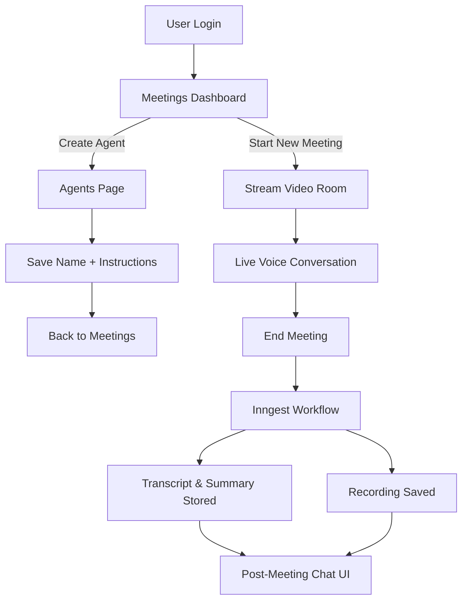

# PeakInterviewsAI

**Realtime mock‑interview rooms with AI agents you design in seconds**

Live Site for testing → https://peakinterviewsai.vercel.app

---

## Project Overview
PeakInterviewsAI lets you spin up a Google‑Meet–style video call with a purpose‑built AI coach. Log in, create an agent by giving it a *name* and a single block of instructions (e.g. “Tutor me in differential equations”), then start a meeting and talk to it live via OpenAI’s ultra‑low‑latency voice model. When you hang up, an Inngest workflow produces a full transcript, a concise summary, the recording link, and a chat‑like Q&A interface so you can ask follow‑up questions about anything that happened.

## How It Works (User Flow)
1. **Login ➜ Meetings Dashboard** – lists past & upcoming sessions.  
2. **Create / Select Agent** – on the **Agents** page: text‑field for name, large textarea for instructions.  
3. **Launch Meeting** – back on dashboard, click *New Meeting*, choose your agent.  
4. **Realtime Conversation** – duplex audio bridged to OpenAI GPT‑4o Voice (< 100 ms latency).  
5. **Post‑Meeting Insights** – Inngest event pipeline stores: transcript, summary, recording, & chat.  

### User Flow Diagram


## System Architecture Diagram
```mermaid
flowchart LR
    subgraph Client
        A1[Browser\nNext.js / React]
    end
    subgraph Edge
        B1[Vercel Edge Function\n(tRPC API)]
        B2[NextAuth]
    end
    subgraph Cloud
        C1[Stream Video API]
        D1[Stream SFU]
        C2[OpenAI GPT‑4o Voice]
        E1[Neon/Postgres]
        F1[Inngest Event Pipeline]
        G1[Polar Payments]
    end

    A1 -->|HTTP / WebSocket| B1
    A1 --> B2
    B1 -->|REST| C1
    A1 -- WebRTC --> D1
    D1 -->|Recording| C1
    B1 -->|Voice Stream| C2
    B1 -->|SQL| E1
    B1 -->|Event (meeting.ended)| F1
    F1 -->|Transcribe + Summarise| C2
    F1 -->|Persist| E1
    B1 -->|Billing Webhook| G1
```

## Key Features
- **One‑Minute Agent Creation** – no JSON, no fine‑tuning; plain‑English instructions suffice.  
- **Stream‑Powered Video Rooms** – reliable SFU with recording out of the box.  
- **OpenAI Voice** – low‑latency, duplex audio for natural back‑and‑forth.  
- **Async Summaries & Analytics** – Inngest retries ensure transcripts never get lost.  
- **Secure Storage** – Drizzle ORM + Neon/Postgres for agents, meetings & user auth.  
- **Usage‑Based Billing** – Polar Payments caps free‑tier minutes and handles upgrades.  

## Tech Stack (High Level)

| Layer         | Technology                                                |
| ------------- | --------------------------------------------------------- |
| Frontend      | Next.js 14, React 19, TypeScript, Tailwind CSS            |
| Video / Audio | Stream Video SDK, OpenAI Speech v2 (TTS & STT)            |
| Backend       | Vercel Edge Functions, tRPC, Inngest                      |
| Database      | Neon Postgres, Drizzle ORM                                |
| Auth          | NextAuth.js (magic link)                                  |
| Billing       | Polar Payments                                            |
| Dev‑Ops       | Vercel CI/CD, Pnpm Monorepo, Eslint, Prettier             |

## What I Learned
- Delivering a **minimal‑prompt agent UX** that users grok immediately.  
- Engineering **< 100 ms voice latency** with WebRTC + OpenAI streaming endpoints.  
- Crafting **idempotent, event‑driven pipelines** in Inngest for media post‑processing.  
- Enforcing **row‑level security** and multi‑tenant schemas in Neon Postgres.  
- Integrating **usage‑metered billing** and handling webhook race conditions.  

## Future Roadmap
- **HeyGen Live Avatar API** – photorealistic interviewer with real‑time lip sync.  
- Panel interviews (multi‑agent rooms).  
- Skill‑progress dashboards & scoring rubrics.  
- Mobile PWA with offline practice mode.  

## License
MIT © 2025 Neel Majmudar
